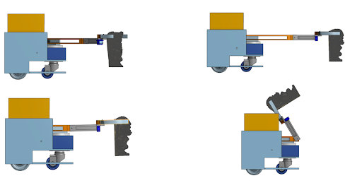

# Autonomous Robot

This repository contains the code used to control team Bing Chilling's robot in the Robot Summer competition of 2022.

The goal of the competition was to build an autonomous robot, completely from scratch, that could traverse the obstacle course shown below, while collecting as many points as possible. The team of four who’s robot collects the most points by picking up treasures and bringing them to the finish line wins! To make it through the course, the robot has to overcome many challenges, including:
- following black tape up a ramp 
- making it across chicken wire
- fitting through a narrow archway
- traveling towards a 10 kHz IR square wave emitter while ignoring a 1 kHz IR square wave emitter which attempts to lead the robot into rocks
- making it across a gap connected by a zipline
- not falling off of the suspension bridge
- not picking up a randomly placed magnetic bomb which looks exactly like any other treasure

*Figure 1: The competition layout.*

Full competition details can be found [here](https://docs.google.com/document/d/1w-FPY5TIh77HwoJq-ieJ4AjniQIBwqUylwcSBE2u_jk/edit).

# Code Directory
* `src/main.cpp` contains the overall algorithm that controls robot behaviour for the competition. 
* `src/tapeFollowing.cpp` contains the methods used to control the movement of the robot. Tape following is implemented using PID control with reflectance sensors positioned at the front of the robot.
* `src/claw.cpp` contains the methods used to control the opening and closing of the claw, the movement of the arm joint, the rotation of the base, and the back and forth motion of the rack and pinion. These methods are used together to execute the procedure for picking up treasures, as shown in Figure 2.
* `src/sonar.cpp` contains the algorithm used to sense whether a detected object is a treasure or not.
* `src/Encoders.cpp` contains methods used to experiment with using an encoder to make precise movements (not used in the final design).

*Figure 2: The pickup procedure.*
