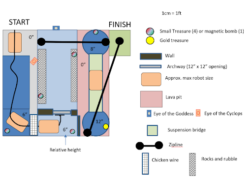

# Autonomous Robot

This repository contains the code used to control team Bing Chilling's robot in the ENPH 253 competition of 2022.

The goal of the competition was to build an autonomous robot, completely from scratch, that could traverse the obstacle course shown below, while collecting as many points as possible. The team of four who’s robot collects the most points by picking up treasures and bringing them to the finish line wins! To make it through the course, the robot has to overcome many challenges, including:
- following black tape up a ramp 
- making it across chicken wire
- fitting through a narrow archway
- traveling towards a 10 kHz IR square wave emitter while ignoring a 1 kHz IR square wave emitter which attempts to lead the robot into rocks
- making it across a gap potentially by scaling a zipline
- not falling off of the suspension bridge
- not picking up the magnetic bomb which looks exactly like any other treasure

*Figure 1: The competition layout.*

Full competition details can be found [here](https://docs.google.com/document/d/1w-FPY5TIh77HwoJq-ieJ4AjniQIBwqUylwcSBE2u_jk/edit).